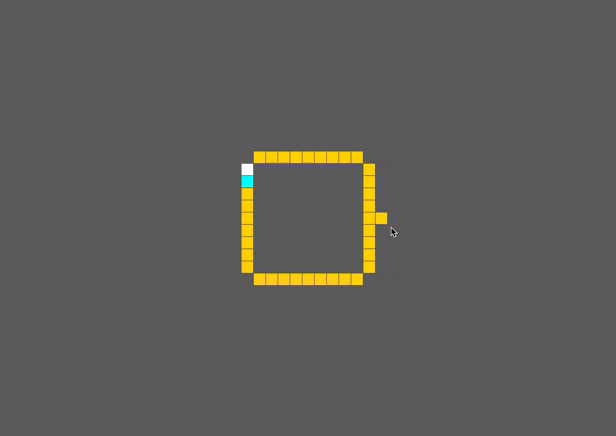
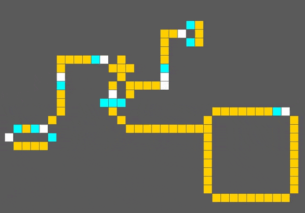
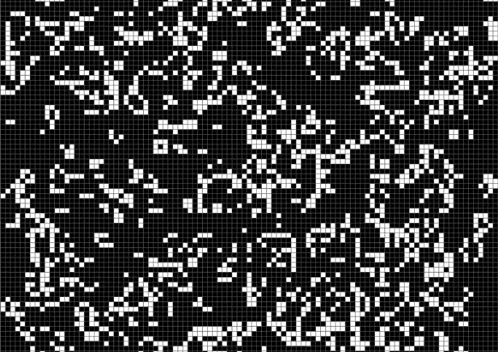
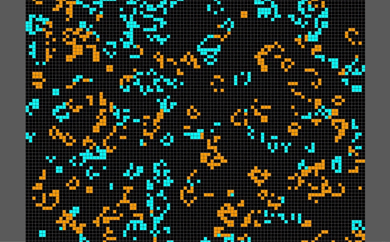
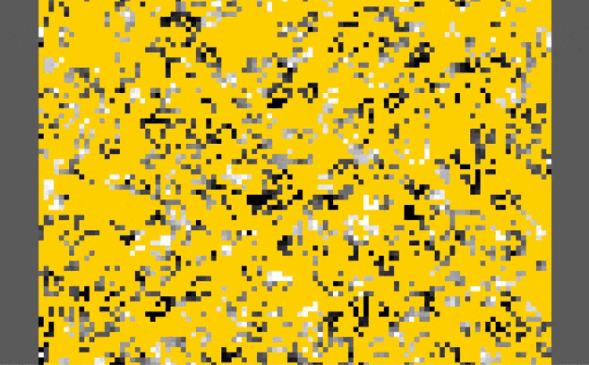
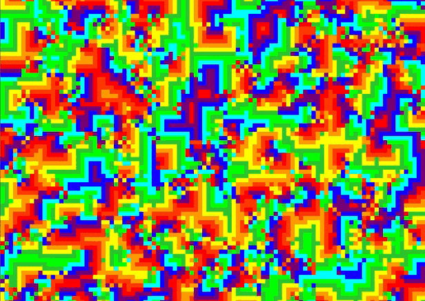
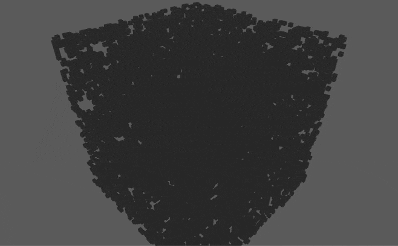

# Bevy Cellular Automaton

 

 
 
 
 
 

<!-- cargo-sync-readme start -->

`bevy_life` is a generic plugin for [cellular automaton](https://en.wikipedia.org/wiki/Cellular_automaton).
From the classic 2D [Conway’s game of life](https://en.wikipedia.org/wiki/Conway%27s_Game_of_Life) to [`WireWorld`](https://en.wikipedia.org/wiki/Wireworld) and 3D rules, the plugin is completely generic and dynamic.

See:
 - [Game of life variations](https://cs.stanford.edu/people/eroberts/courses/soco/projects/2008-09/modeling-natural-systems/gameOfLife2.html)
 - [`Wireworld` implementation](https://www.quinapalus.com/wi-index.html) (see
   this lib's [implementation](https://github.com/ManevilleF/wireworld-rs))
 
## Bevy versions

The `main` branch follows the released version of `bevy` but I provide the [`bevy-main`](https://github.com/ManevilleF/bevy_life/tree/feat/bevy-main) branch
to follow the `main` branch of `bevy`

| `bevy_life`   | `bevy`    |
|---------------|-----------|
| 0.3.x         | 0.6.x     |
| 0.4.x         | 0.7.x     |
| 0.5.x         | 0.8.x     |
| 0.6.x         | 0.9.x     |
| 0.7.x         | 0.10.x    |
| 0.8.x         | 0.11.x    |

## How to use

Add a `CellularAutomatonPlugin` to your bevy app:

A `CellularAutomatonPlugin<C, S>` has two generic types:
- `C` -> Any type implementing `Cell`, defining the coordinate system
- `S` -> Any type implementing `CellState`, defining the simulation rules.

You may add as many generic `CellularAutomatonPlugin` as wished, the lib
provides some implementations like:
- `GameOfLife2dPlugin`
- `GameOfLife3dPlugin`
- `ImmigrationGame2dPlugin`
- `ImmigrationGame3dPlugin`
- `RainbowGame2dPlugin`
- `RainbowGame3dPlugin`
- `WireWorld2dPlugin`
- `WireWorld3dPlugin`
- `CyclicColors2dPlugin`
- `CyclicColors3dPlugin`

Then you may use bevy as usual and add `impl Cell` and `impl CellState`
components to the entities. The lib provides some implementations like
`MooreCell2d` or `MooreCell3d` for cells and `ConwayCellState`,
`WireWorldCellState`, etc for states.

You may implement your own *cells* (coordinate system) and *states* (rules)
as you want, the cellular automaton system is completely dynamic and
generic.

For more information you may look at some examples:
- The [Classic examples](./examples) showcase the provided implementations
- the [Rock Paper Scissor](./examples/2d_rock_paper_scissor.rs) defines
  custom rules.
- the [wireworld](https://github.com/ManevilleF/wireworld-rs) repository

### Pausing

Inserting a `SimulationPause` resource will pause the simulation, removing
it wil resume the it.

### Parallel execution and batching

Inserting a `SimulationBatch` resource will allow parallel computation of
cells with custom batch sizes.

## Cargo Features

No feature is required for the plugin to work and the main traits `Cell` and
`CellState` are always available. But you may enable the following features

- `2D` (enabled by default): Enables 2D types like:
  - `MooreCell2d` (square cell with 8 neighbors)
  - `NeumannCell2d` (square cell with 4 neighbors)
  - `HexagonCell2d` (hexagon cell with 6 neighbors)
  - plugin presets: `GameOfLife2dPlugin`, `ImmigrationGame2dPlugin`,
    `RainbowGame2dPlugin`, `WireWorld2dPlugin`, `CyclicAutomaton2dPlugin`
- `3D`: Enables 3D types like:
  - `MooreCell3d` (cube cell with 26 neighbors)
  - `NeumannCell3d` (cube cell with 6 neighbors)
  - plugin presets: `GameOfLife3dPlugin`, `ImmigrationGame3dPlugin`,
    `RainbowGame3dPlugin`, `WireWorld3dPlugin`, `CyclicAutomaton3dPlugin`
- `auto-coloring` (Example or debug purpose):
  - Enables `CellStateMaterials` resource to contain material handles
  - The `CellState` type now requires to build a `CellStateMaterials`
  - All `CellState` components with materials will be colored according to
    their type.

## Disclaimer

This is probably not the fastest rust implementation of a cellular automaton
in rust. For example, using Gosper's [`HashLife`](https://www.drdobbs.com/jvm/an-algorithm-for-compressing-space-and-t/184406478) a classic game of life could be much faster.

This library aim is to be generic and dynamic, so that you can integrate
cellular automata to any project in bevy, with any rules, in 2D or 3D.

<!-- cargo-sync-readme end -->

## Example projects

### [Wire World][wireworld]

The [wireworld-rs][wireworld] project uses `bevy_life` and wireworld rules to simulate electrical systems.

## Internal Examples

For every example pressing space reloads the board.

> Note: adding the release flag increases performance for examples

### 2D Game of life

Run `cargo run --example 2d_game_of_life --features auto-coloring`

### 2D Immigration game

Run `cargo run --example 2d_immigration_game --features auto-coloring`

### 2D Rainbow game

Run `cargo run --example 2d_rainbow_game --features auto-coloring`

### 2D Cyclic colors

Run `cargo run --example 2d_cyclic_colors --features auto-coloring`

### 2D Rock paper scissor

This example showcases how to define custom rules

Run `cargo run --example 2d_rock_paper_scissor`

### 3D Game of life (4555 rule)

Run `cargo run --example 3d_game_of_life --features "3D auto-coloring" --no-default-features`

[wireworld]: https://github.com/ManevilleF/wireworld-rs "Wire world project"
